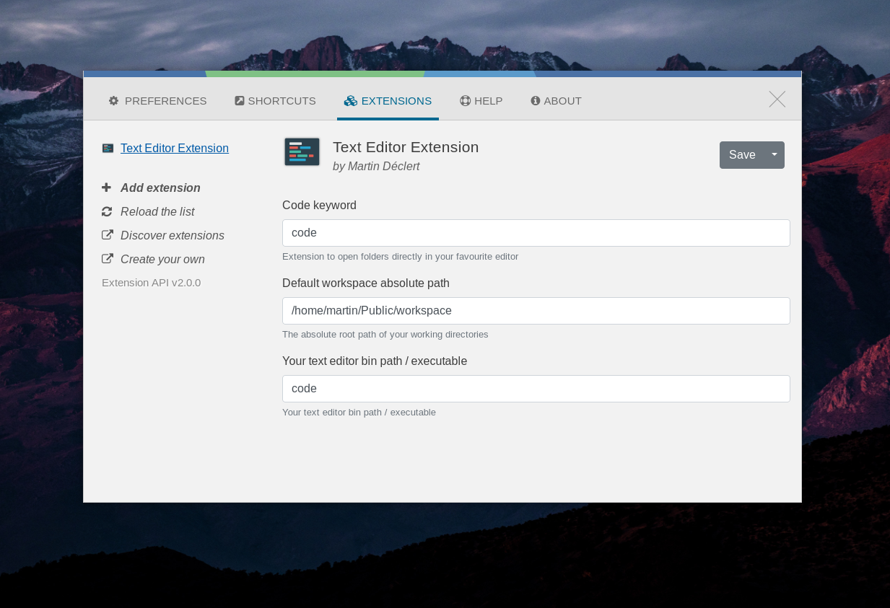

# Text Editor Ulauncher extension

[Ulauncher](https://ulauncher.io/) app launcher extension, to open directory with your favourite text editor

## Config

You can configure :
- keyword to call extension
- path of your projects directory
- executable of your text editor

## Demo

Use this extension to browse your project directories and open it in your favourite text editor